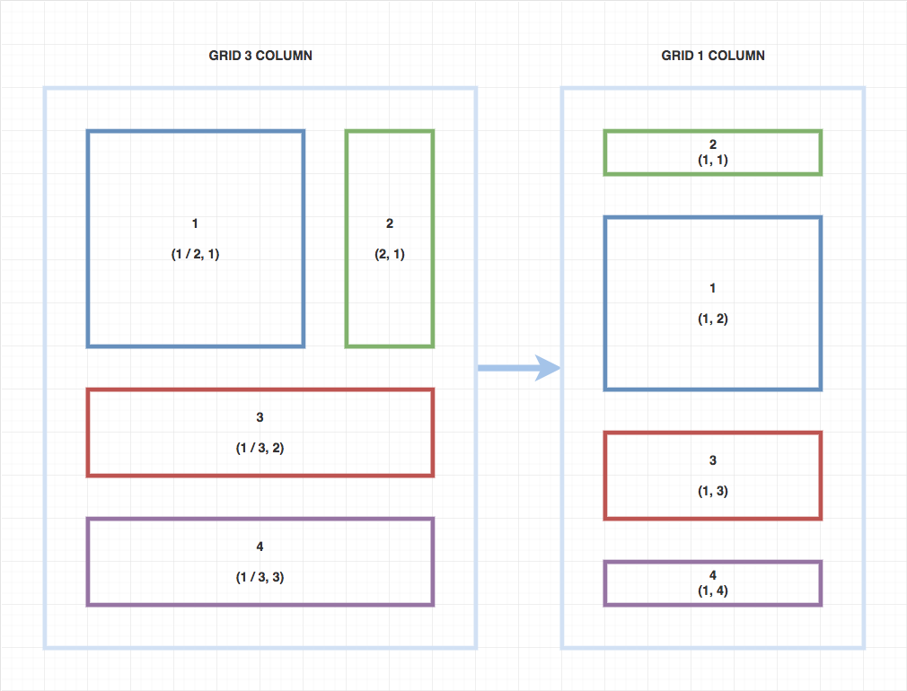

# Gridfy



Dynamic Layout with CSS Grid.

### How to use?

Include Gridfy.js into your HTML file like this :

```html
<script src="https://raw.githubusercontent.com/muhibbudins/gridfy/master/dist/gridfy.min.js"></script>
```

And then add HTML structure like example below :

```html
<!-- Static Grid -->
<div data-grid="4">
  <div class="example">
    Column 1
  </div>
  <div class="example">
    Column 2
  </div>
  <div class="example">
    Column 2
  </div>
</div>

<!-- Dynamic Grid -->
<div data-dynamic="true" data-grid="3">
  <div data-column="1" data-row="1" class="example">
    Column 1
  </div>
  <div data-column="1" data-row="2" class="example">
    Column 1
  </div>
  <div data-column="2" data-row="2" class="example">
    Column 2
  </div>
  <div data-column="3" data-row="3" class="example">
    Column 2
  </div>
</div>

<!-- Auto Grid -->
<div data-grid="3">
  <div data-desktop="1, 1" data-tablet="2, 1" class="example">
    Column 1
  </div>
  <div data-desktop="2, 2" data-tablet="1, 2" class="example">
    Column 2
  </div>
  <div data-desktop="3, 3" data-tablet="3, 3" class="example">
    Column 2
  </div>
</div>

<!-- Stacked Grid -->
<div data-grid="3">
  <div class="example">
    <div data-grid="2">
      <div class="example">
        Column 1
      </div>
      <div class="example">
        Column 2
      </div>
    </div>
  </div>
  <div class="example">
    Column 2
  </div>
  <div class="example">
    <div data-grid="2">
      <div class="example">
        Column 1
      </div>
      <div class="example">
        Column 2
      </div>
    </div>
  </div>
</div>
```

Last, run gridfy using this code :

```html
<script>
  new Gridfy({
    selector: '[data-grid]'
  })
</script>
```

### License

This project under MIT License
